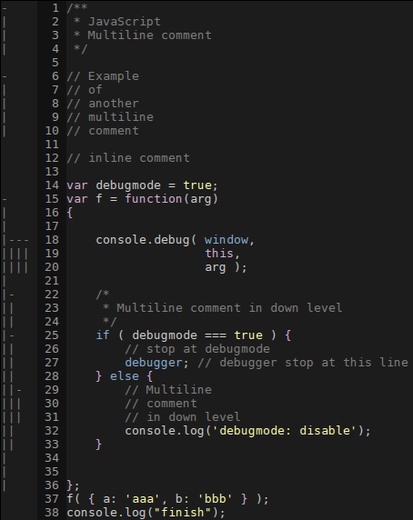
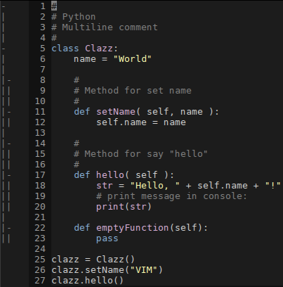

TrueFolds
=========

VIM plugin for make foldings as in traditional text editors and IDE.

Foldings based on indents and for multiline comments.

Example for JavaScript:

Example for Python:

Installation
------------

For pathogen:

    cd ~/.vim/bundle
    git clone https://github.com/pavel-g/TrueFolds.git

License
=======

GPLv3
